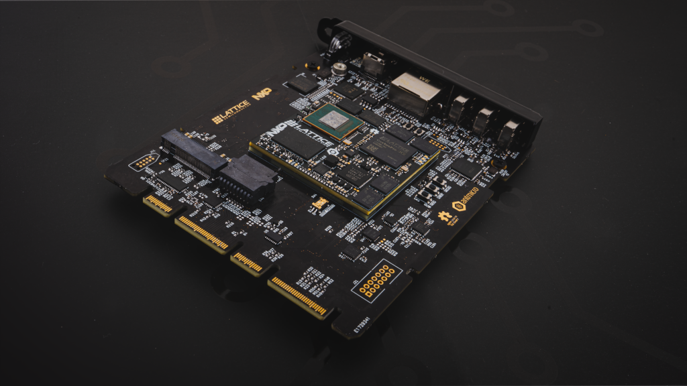

# DC-SCM Carrier Card for OSM-L SoMs

Copyright (c) 2025 [Antmicro](https://www.antmicro.com)

## Overview

This project includes open hardware design files for a DC-SCM compliant PCB that supports System on Modules following the [OSM-L](https://sget.org/standards/osm/) standard specified by the SGet group.
The DC-SCM follows the interface and mechanical outline described in the 2.1 revision of the [DC-SCM standard](https://drive.google.com/file/d/1-SdSQvSWy5pNN_kBiyztblxE4jdyUe9W/view?usp=sharing) specified by the Open Compute Project community.
Apart from establishing a base DC-SCM compliant platform, the design includes a series of breakout connectors, jumpers and other supplementary circuitry for developing BMC software features for security, reliability, commissioning and benchmarking.

This DC-SCM card has been designed as a carrier board to an L-sized OSM design that combines a Lattice FPGA and an NXP i.MX943 series Application Processor (AP).

The PCB design files were prepared in [KiCad](kicad.org/download) 9.x

## Key features

* Landing pad for OSM-L type of SoM
* Realtek 1Gb Ethernet PHY (Realtek [RTL8211FDI-CG](https://openhardware.antmicro.com/components/realtek-rtl8211fdi-cg/?view=front-iso&tab=footprint))
* ITE LVDS-DisplayPort bridge
* USB-C port with FTDI FT4232 for SoM debug and software integration 
* USB-C port connected to the OSM-L SoM pads 
* USB-C port connected to the HPM
* M.2 (key-M) expansion slot connected to the HPM 
* Slot for removable BIOS memories connected directly to the HPM
* Optional on-board TPM connector 

## Project structure 

The main directory contains KiCad PCB project files, a LICENSE and a README.
The remaining files are stored in the following directories: 

* `img` contains graphics for this README

## Licensing

This project is published under the [Apache-2.0](LICENSE) license.
